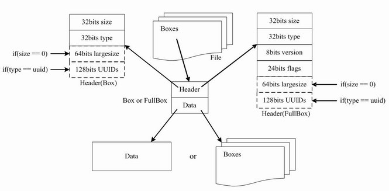

#iOS中的视频播放(一) - 元数据格式解析
在Apple的环境下，主要遇到的媒体分为以下四种，`quicktime(mov)`，`MPEG-4 video`([链接](https://zh.wikipedia.org/wiki/MP4))，`MPEG-4 audio`，`mp3`。其中视频播放的元数据主要是MP4和mov，而MP4派生于mov,所以他们的格式文件是很相似的，这里详细分析以下MP4的文件格式。

####1.1 基本概念
1. `文件`, 是由一种称为 atoms(boxs) 的数据结构组成。
2. `atoms`([链接](http://mp4ra.org/atoms.html)), 一个 atom 包含了描述媒体的某种数据的集合或者其他 atom。每个 Box 都是由 Header 和 data 组成。标准的box开头的4个字节为 `box size`，该大小包括 `box header` 和 `box body` 整个 box 的大小，这样我们就可以在文件中定位各个 box。size 后面紧跟的32位为 `box type`, 一般是4个字符，如`ftyp`、`moov`等，这些 box type 都是已经预定义好的, 分别表示固定的意义。如果是 `uuid`, 表示该 box 为用户扩展类型。如果 box type 是未定义的，应该将其忽略。
3. `Header`, 包含了整个 atom 的长度 size 和类型 type。
4. `Data`, 是 atom 的实际数据，可以是纯数据也可以是更多的子 atoms。

	具体结构如下图所示:

Box结构图

### 1.2 atom详解
在1.1中了解到，视频文件的核心就是基本数据结构atoms。atoms主要分为分为 `Movie atom`,`Movie header atom` , `Track atom`, `Track Header atom`, `Media atom`,  `Video media information atom`, `Sample table atom`。一般来说，解析媒体文件，最关心的部分是视频文件的宽高、时长、码率、编码格式、帧列表、关键帧列表，以及所对应的时戳和在文件中的位置，这些信息，主要包含在 atoms 的header里。

####1.2.1 Movie atom
`Movie atom` 通常包含一个 `Movie Header atom（mvhd)` 包含至少一个track atom; 另外还存在一些可选的 atom ，如下图所示：

###1.2.2 Movie header atom
`Movie header atom` 定义整个 movie 的`time scale`, `duration`, `创建时间`, `修改时间`等详细信息,其中`duration / timescale`等于可以播放的时长。主要属性和结构如下:

###1.2.3 Track atom
`Track atom` 定义了每个音频轨道、字幕轨道、视频轨道的具体描述信息。一个MP4文件中的媒体可以包含多个track，且至少有一个track，这些track之间彼此独立，有自己的时间和空间信息。`trak`必须包含一个`tkhd`和一个`mdia`，这时候 通过 Track atom
的自我描述，可以识别正确的轨道。具体如下:

###1.2.4 Track header atom
`Track header atom` 定义了Track的`Track ID`, `Track时长`, `创建时间`, `修改时间`等详细信息，具体如下:

###1.2.5 Media atom
`Media atom(mdia)` 定义了track媒体类型以及sample数据，描述sample信息。一般 mdia 包含 `media header box(mdhd)`, `handler reference box(hdlr)` 和 `media information box(minf)`。
其中，mdhd 的 `language`字段代表了媒体语言码。hdlr解释了媒体的播放过程信息。minf 存储了解释 track 媒体数据的 `handler-specific` 信息，media handler用这些信息将媒体时间映射到媒体数据并进行处理,它的字段`opcolor`表述了视频的 RGB。其它的一些字段不再分析，与mvhd重复。

###1.2.6 Sample table atom
`Sample table atom(stbl)` 几乎是普通的MP4文件中最复杂的一个box，含了关于 track 中 sample 所有时间和位置的信息，以及sample的编解码等信息。利用这个表，可以解释 sample 的时序、类型、大小以及在各自存储容器中的位置。stbl 是一个`container box`，其子box包括：`sample description box（stsd`）、`time to sample box（stts)`、`sample size box（stsz或stz2）`、`sample to chunk box（stsc）`、`chunk offset box（stco或co64）`、`composition time to sample box（ctts）`、`sync sample box（stss）`等。

* `stsd`存储了 media sample 的存储位置。
* `stts`存储了 sample 的 时长和时序映射，我们通过它提供的位移量可以找到任何时间的 sample。
* `stsz`存储了媒体中全部 sample 的数目和记录每个 sample 大小的表。
* `stsc`用 chunk 组织 sample 可以方便优化数据获取，一个 thunk 包含一个或多个 sample。
* `stss`确定 media 中的关键帧。对于压缩媒体数据，关键帧是一系列压缩序列的开始帧，其解压缩时不依赖以前的帧，而后续帧的解压缩将依赖于这个关键帧。
* `stco`定义了每个 thunk 在媒体流中的位置。

###回顾
本文结合MP4的文件格式分析了媒体播放的元数据格式，通过一些工具将视频用二进制的形式打开就可以详细查看以上属性。在实际工作中，我们结合对文件的分析和理解，就可以更好的使用系统提供的AVFundation SDK 的一些方法。

### reference
[MIME Type Registration for MPEG-4](https://tools.ietf.org/html/rfc4337) 
[Movie Atoms](https://developer.apple.com/library/mac/documentation/QuickTime/QTFF/QTFFChap2/qtff2.html)