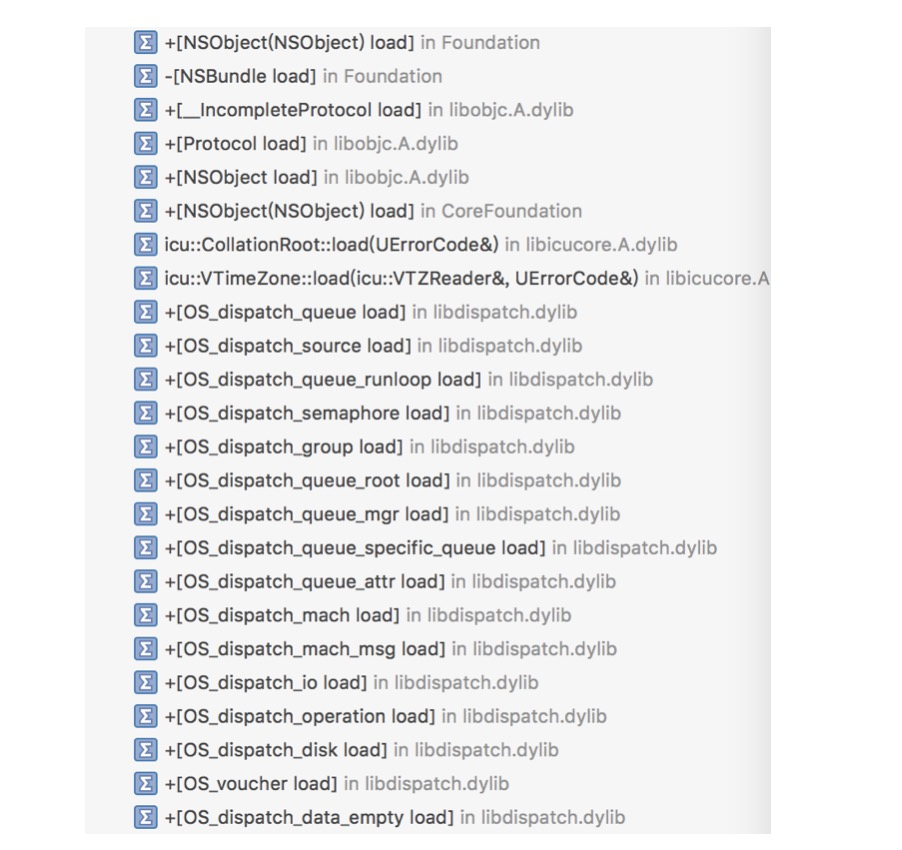

新版本源码已经有较大的改动，eg +load 就在 load mapped images 中动态调用，下文已经无效

#iOS APP 的生命周期
## 前言
我们习惯而轻松的在framework下编写APP，通过CocoaMVC管理每个页面的生命周期，可是一个APP的生命周期是什么样的呢？本篇文章会以开源项目RMNetwork简述一个APP的生命周期。

## APP
Xcode 编译代码以后，除了一些资源文件，会生成 `.APP` 的可执行文件，这个可执行文件的组成可以通过开启编译选项 `Write Link Map File` 得到可执行文件的详细信息。如下图所示: 

解析 `linkMap` 的文件，我们可以发现目标文件列表，描述了我们引用的第三方的静态链接库(.a)的地址。接着是一个段表，表明了代码段、数据段、数据等在文件中的偏移位置及大小。

## Kernel
引用**《Mac OS X and iOS Internals : To the Apple's Core》**中图片的描述:

当 Kernel 为我们应用程序初始化好进程和空间后，核心步骤大概分为4步，首先通过 `exec_active_iamge`方法加载编译好的可执行文件，之后会通过 `load_dylinker` 方法载入动态链接器，然后通过 thread_setuserstack 方法配置用户栈环境，最后通过 `thread_setentrypoint` 方法指定动态链接器的入口。

## dyld
apple开源的动态链接解析器。iOS中用到的所有系统 framework 都是动态链接的，在上述步骤中，Kernel指定了动态链接器的入口，dyld会将程序依赖的动态链接库递归加载进内存，查找并绑定符号，最后找到可执行文件的main函数，准备参数并调用。dyld会将程序依赖的动态链接库递归加载进内存。

~~## +load()
在main函数执行前，所有的OC实现类都会先执行`load()`方法。添加全局断点就可以调试出这个特性:

~~这也引出一个开发中需要十分注意的地方，因为load方法在main之前执行的，所以如果重载了这个方法就会在应用启动的过程中占用cpu时间，造成启动缓慢。

## main
   进入我们最熟悉的main入口后，系统通过在`@autoreleasepool`将我们的程序放在了自动释放池中，同时启动了Main Run Loop，会通过runloop管理我们的应用事件，并在runloop的循环间隙中，通过内存引用双链表管理内存。同时，也会在这里指定app运行时的代理app delegate。

## UIApplication
Main函数中启动的UIApplication，负责管理用户与iOS设备交互时产生的事件(Multitouch Events，Motion Event，Remote Control Event)，handle到的事件分发给control objects(UIControl)对应的target objects来处理并且管理整个事件循环。

##  App delegate
App delegate对象遵循`UIApplicationDelegate`协议，响应app运行时重要事件，程序启动成功后会进入App delegate 的回调函数didFinishLaunchingWithOptions，同时当运行时的程序被挂起，恢复，终止时，也会通过 App delegate 进行管理。

## 总结
本文简单的总结了iOS APP生命周期管理的过程，需知一段简单的代码从运行到绘制到屏幕上，经历了非常复杂的过程，系统帮我们默默实现了很多工作，并且很好的封装了视图层次的生命周期，才让我们可以更加轻松的开发。
